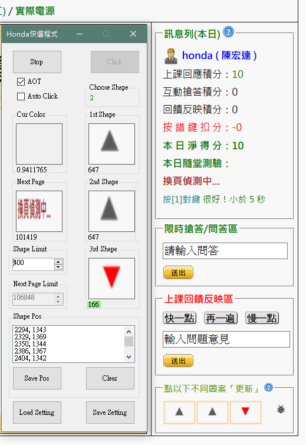
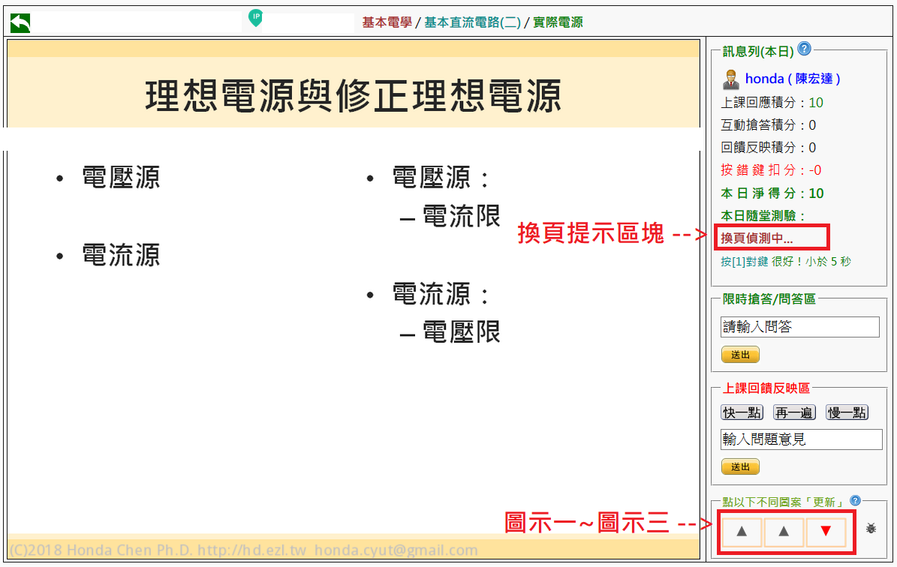

<h1>Honda快選程式 Honda Web Selector</h1>
<h2>半成品注意！</h2>
<h2 style="color: darkred; font-style: italic;">本程式如有造成任何問題，一概不負責。 --使用本程式即同意此項條款</h2>
<h3>操作方式</h3>
<h3>1. 使用鼠標位置進行圖示擷取：
    
首先點選一下程式，將程式設成前景，並使用鍵盤 [Tab] 按鍵，將按鍵焦點移至 "Save Pos" 按鈕身上，接著把滑鼠指在圖示一左上角，使用鍵盤 [Space] 按鍵，觸發 "Save Pos" 按鈕按下事件，再把滑鼠指在圖示一右下角，同樣使用鍵盤 [Space] 按鍵，觸發 "Save Pos" 按鈕按下事件，即可完成選取圖示一之擷取範圍，接著依序將圖示二、圖示三以及換頁偵測區塊進行擷取範圍選取。

    2. 點選 "Start" 按鈕即可開始在提示換頁後，自動選取三個圖示中不一樣的圖示，使用者僅需直接點擊滑鼠左鍵，方能進行換頁動作。
</h3>
<h4>注意事項：
    <li>Windows 介面縮放係數須為 100%，否則會造成圖示擷取座標位移</li>
    <li>進行第一次快選時，建議手動針對 "Shape Limit" 進行校正</li>
    <li>建議先熟悉使用鍵盤 [Tab] 及 [Space] 按鍵來觸發按鈕的按下事件，以免當滑鼠鎖定時，不知該如何解除滑鼠鎖定之窘境。</li>
</h4>

<h4>程式運作功能 
    <li>AOT 選項：應用程式總是在最上層 </li>
    <li>Shape Limit：圖示差異靈敏度 (數值越小，圖示愈容易被當成不同圖示)</li>
    <li>Shape Pos：每兩組座標形成一個選取區，總共有四個選取區，依序為圖示一、圖示二、圖示三及換頁偵測區塊。</li>
    <li>Clear：清除所有座標</li>
    
</h4>
<h4>網頁區塊介紹 </h4>
